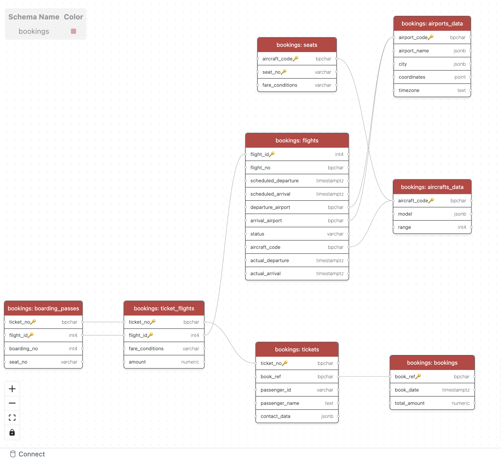

# 🛩️ Data Engineering Workshop - Airlines Database

> A practical Data Engineering workshop with SQL pipelines & exercises for learning database management and query optimization.

[](https://www.postgresql.org/)
[](https://www.docker.com/)
[](https://www.getdbt.com/)
[](https://opensource.org/licenses/MIT)

## 📋 Table des Matières

- [🎯 Objectif du Workshop](#-objectif-du-workshop)
- [⏺️ Sessions Enregistrées](#️-sessions-enregistrées)
- [🏗️ Architecture de la Base de Données](#️-architecture-de-la-base-de-données)
- [🚀 Démarrage Rapide](#-démarrage-rapide)
- [📊 Structure du Projet](#-structure-du-projet)
- [💡 Exercices SQL](#-exercices-sql)
- [🚀 Projet dbt - Data Build Tool](#-projet-dbt---data-build-tool)
- [🐍 Projet Python - Pipeline ETL](#-projet-python---pipeline-etl)
- [📚 Ressources](#-ressources)
- [👤 Auteur](#-auteur)
- [📜 Licence](#-licence)

## 🎯 Objectif du Workshop

Ce workshop propose une approche pratique de l'ingénierie des données à travers :
- **Manipulation de données** avec PostgreSQL
- **Requêtes SQL avancées** (JOINs, agrégations, fonctions window)
- **Pipeline de données** avec Docker
- **Transformation de données** avec dbt (data build tool)
- **Projets Python** orientés Data Engineering
- **Analyse de données** sur des datasets réalistes

## ⏺️ Sessions Enregistrées

Retrouvez nos précédentes sessions enregistrées :

1. **Introduction au Data Engineering** : [https://kloo.me/dataeng-workshop-1](https://kloo.me/dataeng-workshop-1)
2. **SQL pour le Data Engineering Partie 1** : [https://kloo.me/dataeng-workshop-2](https://kloo.me/dataeng-workshop-2)
3. **SQL pour le Data Engineering Partie 2** : [https://kloo.me/dataeng-workshop-3](https://kloo.me/dataeng-workshop-3)
4. **Transformation des données avec dbt** : [https://kloo.me/dataeng-workshop-4](https://kloo.me/dataeng-workshop-4)

📦 **Repository** : [https://github.com/IFRI-Future-of-AI/Data-Eng-Workshop](https://github.com/IFRI-Future-of-AI/Data-Eng-Workshop)

## 🏗️ Architecture de la Base de Données

Le workshop utilise une base de données de démonstration **Airlines** simulant le système d'une compagnie aérienne :

### 📊 Schéma Principal



### 🗄️ Tables Principales

| Table | Description | Rôle |
|-------|-------------|------|
| **bookings** | Réservations principales | Point central des réservations |
| **tickets** | Billets individuels | Un billet par passager |
| **ticket_flights** | Segments de vol | Correspondances et trajets multiples |
| **flights** | Vols programmés | Informations de vol complètes |
| **airports** | Aéroports | Données géographiques et codes |
| **aircrafts** | Modèles d'avions | Spécifications techniques |
| **seats** | Configuration des sièges | Plan de cabine par appareil |
| **boarding_passes** | Cartes d'embarquement | Attribution des sièges |

### 🔄 Relations Principales
- **1 réservation** → **N billets** (plusieurs passagers)
- **1 billet** → **N segments de vol** (correspondances)
- **1 vol** → **1 appareil** → **N sièges**
- **1 siège** → **1 carte d'embarquement** par vol

## 🚀 Démarrage Rapide

### 📋 Prérequis

- [Docker](https://www.docker.com/get-started) et Docker Compose
- [Git](https://git-scm.com/)
- Un client PostgreSQL (optionnel) : [pgAdmin](https://www.pgadmin.org/), [DBeaver](https://dbeaver.io/)

### ⚡ Installation

1. **Cloner le repository :**
   ```bash
   git clone https://github.com/IFRI-Future-of-AI/Data-Eng-Workshop.git
   cd Data-Eng-Workshop
   ```

2. **Lancer la base de données :**
   ```bash
   docker compose up -d
   ```

3. **Vérifier le déploiement :**
   ```bash
   docker compose ps
   ```

### 🔗 Connexion à la Base

| Paramètre | Valeur |
|-----------|--------|
| **Host** | `localhost` |
| **Port** | `5432` |
| **Database** | `postgres` |
| **Username** | `postgres` |
| **Password** | `postgres` |

## 📊 Structure du Projet

```
Data-Eng-Workshop/
├── 📁 assets/          # Images et diagrammes
│   └── schema.png      # Schéma de la base de données
├── 📁 data/            # Données de démonstration
│   └── demo-small-en.sql
├── 📁 dbt_projects/    # Projets dbt pour la transformation de données
│   └── dbt_demo/       # Projet dbt avec modèles, tests et analyses
├── 📁 notebooks/       # Notebooks Jupyter pédagogiques
│   └── 03-Organisation projet.ipynb  # Guide d'organisation de projet
├── 📁 pdf/             # Présentations du workshop
├── 📁 python_project/  # 🆕 Projet Python complet (Pipeline ETL)
│   ├── src/            # Code source modulaire
│   ├── main.py         # Point d'entrée du pipeline
│   ├── pyproject.toml  # Configuration et dépendances
│   └── README.md       # Documentation détaillée
├── 📁 sql/             # Scripts SQL avancés
├── 📄 Database.md      # Documentation du schéma
├── 📄 Request.md       # Exercices SQL détaillés
├── 🐳 docker-compose.yml  # Configuration Docker
└── 📖 README.md        # Ce fichier
```

## 💡 Exercices SQL

### 🎯 Niveau Débutant
- ✅ **Sélection simple** : Afficher tous les vols
- ✅ **Filtrage** : Vols au départ d'un aéroport spécifique
- ✅ **Tri et limitation** : Les 5 derniers vols enregistrés
- ✅ **Agrégation** : Nombre total de tickets émis

### 🎯 Niveau Intermédiaire
- ✅ **INNER JOIN** : Vols avec noms d'aéroports
- ✅ **CROSS JOIN** : Combinaisons vol-appareil
- ✅ **Cast de types** : Conversion de dates en texte
- ✅ **CASE WHEN** : Catégorisation des statuts

### 🎯 Niveau Avancé
- ✅ **COALESCE** : Gestion des valeurs nulles
- ✅ **JSON** : Extraction de données de contact
- ✅ **Fonctions window** : Analyses temporelles
- ✅ **CTE** : Requêtes complexes structurées

### 📝 Accès aux Exercices

Consultez le fichier [Request.md](Request.md) pour tous les exercices SQL avec :
- 📋 **Énoncés détaillés**
- 💻 **Requêtes SQL complètes**
- 🎯 **Objectifs pédagogiques**
- 🔍 **Solutions expliquées**

## 🚀 Projet dbt - Data Build Tool

Le workshop inclut maintenant un projet dbt complet pour la transformation et la modélisation des données !

### 🎯 Vue d'ensemble

dbt (data build tool) permet de transformer les données directement dans votre entrepôt de données en utilisant du SQL. Le projet dbt inclus dans ce workshop implémente une architecture moderne en 3 couches :

- **🔄 Staging** : Nettoyage et standardisation des données sources (8 modèles)
- **⚙️ Intermediate** : Enrichissement et agrégation des données (3 modèles)
- **📊 Marts** : Tables finales optimisées pour l'analyse (5 modèles)

### 📦 Contenu du Projet dbt

Le projet `dbt_projects/dbt_demo/` comprend :

- **16 modèles SQL** organisés en couches (staging, intermediate, marts)
- **6 macros réutilisables** pour les transformations courantes
- **4 seeds** (données de référence en CSV)
- **5 analyses métier** prêtes à l'emploi
- **80+ tests de qualité** des données
- **Documentation complète** avec lineage interactif

### 🎨 KPIs et Analyses Disponibles

Le projet dbt permet de calculer des KPIs critiques :

#### Finance
- Revenus totaux et par période
- Revenu moyen par passager
- Distribution par classe tarifaire

#### Opérations
- Taux de ponctualité des vols
- Retards moyens
- Taux d'occupation des vols
- Performance par route/appareil

#### Clients
- Lifetime value
- Nombre de vols par passager
- Segmentation et fidélisation

### ⚡ Démarrage Rapide dbt

```bash
# 1. Installer dbt
pip install dbt-postgres

# 2. Naviguer vers le projet
cd dbt_projects/dbt_demo

# 3. Tester la connexion
dbt debug

# 4. Exécuter le pipeline complet
dbt build

# 5. Générer et visualiser la documentation
dbt docs generate
dbt docs serve
```

### 📚 Documentation dbt

Pour plus d'informations, consultez :
- 📖 [README du projet dbt](dbt_projects/dbt_demo/README.md) - Guide principal
- ⚡ [Guide de démarrage rapide](dbt_projects/dbt_demo/QUICKSTART.md) - Opérationnel en 5 minutes
- 🏗️ [Architecture détaillée](dbt_projects/dbt_demo/STRUCTURE.md) - Structure complète du projet
- 💡 [Suggestions d'amélioration](dbt_projects/dbt_demo/SUGGESTIONS.md) - Évolutions futures

## 🐍 Projet Python - Pipeline ETL

Le workshop inclut maintenant un projet Python complet illustrant les bonnes pratiques de Data Engineering !

### 🎯 Vue d'ensemble

Le projet `python_project/` implémente un pipeline ETL (Extract, Transform, Load) moderne pour gérer les données des taxis NYC. Il démontre une architecture modulaire et des patterns professionnels de Data Engineering.

### 📦 Contenu du Projet Python

- **🔄 ETL complet** : Téléchargement, transformation et chargement de données
- **📊 Polars** : Utilisation de la bibliothèque DataFrame moderne et performante
- **🗄️ PostgreSQL** : Ingestion automatique dans une base de données
- **📝 Logging structuré** : Traçabilité complète de toutes les opérations
- **⚙️ Configuration** : Gestion moderne avec `.env` et `uv`
- **🎨 Architecture modulaire** : Code réutilisable et maintenable

### 🚀 Caractéristiques Clés

#### Architecture
- ✅ Séparation des responsabilités (download, database, save, transform)
- ✅ Package Python structuré avec `src/`
- ✅ Gestion de configuration centralisée

#### Qualité de Code
- ✅ Docstrings complètes et type hints
- ✅ Logging multi-niveau (fichier + console)
- ✅ Gestion d'erreurs robuste
- ✅ Téléchargement incrémental

#### Performance
- ✅ Utilisation de Polars (plus rapide que Pandas)
- ✅ Format Parquet pour compression efficace
- ✅ Chargement par batch

### ⚡ Démarrage Rapide Python

```bash
# 1. Naviguer vers le projet
cd python_project

# 2. Installer les dépendances avec uv
uv venv
source .venv/bin/activate
uv pip install -e .

# 3. Configurer PostgreSQL (si nécessaire)
cd .. && docker compose up -d && cd python_project

# 4. Exécuter le pipeline
python main.py
```

### 📚 Documentation Python

Pour plus d'informations, consultez :
- 📖 [README du projet Python](python_project/README.md) - Documentation complète
- 🔧 [Organisation de Projet](notebooks/03-Organisation%20projet.ipynb) - Bonnes pratiques

### 🎓 Ce que vous apprendrez

- Architecture d'un projet Python moderne pour le Data Engineering
- Gestion de dépendances avec `uv`
- Patterns ETL professionnels
- Logging et observabilité
- Configuration avec variables d'environnement
- Utilisation de Polars pour la manipulation de données
- Ingestion de données dans PostgreSQL

---

## 📚 Ressources

### 📖 Documentation
- [Documentation PostgreSQL](https://www.postgresql.org/docs/)
- [Guide SQL pour Débutants](https://www.w3schools.com/sql/)
- [Docker Compose Guide](https://docs.docker.com/compose/)
- [Documentation dbt](https://docs.getdbt.com/) - Guide complet de dbt
- [dbt Best Practices](https://docs.getdbt.com/guides/best-practices) - Bonnes pratiques
- [Polars Documentation](https://pola-rs.github.io/polars-book/) - DataFrame moderne
- [uv Package Manager](https://github.com/astral-sh/uv) - Gestionnaire Python rapide

### 🔧 Outils Recommandés
- **IDE SQL** : [DBeaver](https://dbeaver.io/), [pgAdmin](https://www.pgadmin.org/)
- **Client Terminal** : `psql`
- **Transformation de données** : [dbt](https://www.getdbt.com/)
- **Visualisation** : [Grafana](https://grafana.com/), [Metabase](https://www.metabase.com/)

### 📊 Dataset
Le dataset Airlines contient :
- **✈️ Vols** : Horaires, statuts, routes
- **🎫 Réservations** : Données clients et billets
- **🛫 Aéroports** : Codes IATA, géolocalisation
- **🛩️ Appareils** : Modèles et configurations

## 👤 Auteur

**Abraham KOLOBOE** - *Data Engineer & Formateur*

- GitHub: [@abrahamkoloboe27](https://github.com/abrahamkoloboe27)
- LinkedIn: [Abraham KOLOBOE](https://www.linkedin.com/in/abraham-zacharie-koloboe-data-science-ia-generative-llms-machine-learning/)
- Organisation: [IFRI Future of AI](https://github.com/IFRI-Future-of-AI)

## 🤝 Contribution

Les contributions sont les bienvenues ! Pour contribuer :

1. Forkez le projet
2. Créez une branche feature (`git checkout -b feature/AmazingFeature`)
3. Committez vos changements (`git commit -m 'Add some AmazingFeature'`)
4. Pushez sur la branche (`git push origin feature/AmazingFeature`)
5. Ouvrez une Pull Request

## 📜 Licence

Ce projet est sous licence MIT - voir le fichier [LICENSE](LICENSE) pour plus de détails.

---

<div align="center">
  
  **⭐ Si ce workshop vous a été utile, n'hésitez pas à lui donner une étoile !**
  
  Made with ❤️ by [IFRI Future of AI](https://github.com/IFRI-Future-of-AI)
  
</div>
